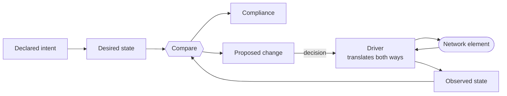

# ACE-X

**An implementation of the ACE architecture — Automation & Control Ecosystem.**

[](LICENSE)
[](https://www.python.org/downloads/)

ACE-X manages networks by keeping **what the network should be** strictly apart from **the hardware that happens to run it** and from **what the devices actually report back**. Configuration is written as code against logical nodes, rendered to real hardware through drivers, read back through the same drivers, and continuously compared.

The result is a system where infrastructure changes go through review and land in a maintenance window, while services are delivered on demand — without the two blocking each other.

---

## The ACE architecture

ACE is an architecture for administering and automating networks. It describes how to organise the problem — not how to write the code. ACE-X is one implementation of it; the sections after this one describe how ACE-X in particular does the job.

The architecture rests on seven ideas. Each answers a problem that network administration runs into by itself, and no single one of them is the point — they compound. Separating hardware from the logical network is what lets a design exist before the equipment does. The neutral model is what makes drift measurable at all. Deriving state rather than storing it is what keeps monitoring from falling behind the network. Splitting configuration into two planes is what makes a deferred change tolerable to live with. Each is useful alone; together they remove the trade-offs that otherwise force a choice between control and lead time.

### 1. The logical network is separate from the hardware that runs it

Networks are traditionally administered as a set of devices. ACE separates them into two independent things.

A **logical node** is a participant in the network: its identity, its role, its place, and all of its configuration. It is what the network design is expressed in.

An **asset** is a piece of hardware: a make, a model, a serial number, a software version. Nothing more. It holds no configuration and has no identity in the network.

A **node** is a binding between the two, and it has a lifecycle of its own — planned, installed, active, retired.

```
logical node          asset
 identity              make / model
 role                  serial
 place        ──┬──    software version
 configuration  │
                │
              node
      binding + lifecycle
```

The separation is not bookkeeping. It changes what is possible:

- Design and configuration exist before any hardware does. A site can be fully specified and its configuration generated while the equipment is still on order.
- Replacing failed hardware rebinds an asset. The network design is untouched, because the design never referred to that serial number.
- Several pieces of hardware can present as one logical participant — a stack, a chassis pair, a redundant pair — without the design knowing or caring.

### 2. One neutral model in the middle, and symmetric translation

ACE defines a **vendor-neutral model** of what a network node is configured to do. It is the only representation the architecture works in.

Translation to and from any particular platform happens in one place, a **driver**, and it works in both directions:

- **outward** — the neutral model becomes configuration for a specific platform
- **inward** — a specific platform's configuration becomes the neutral model

One driver, both directions. Because the same driver owns both translations, the two cannot disagree about what a given construct means. And because everything above the driver speaks only the neutral model, no part of the system other than a driver knows which vendors exist.

This is what makes the rest of the architecture possible: intent and reality end up expressed in the same terms, so they can be compared.



### 3. State is declared and derived, never stored

Desired state is not a document that is edited and saved. It is **derived on demand** from declared intent, every time it is asked for.

The consequence is that desired state cannot go stale and cannot drift from the declaration that produced it. There is no saved artefact to forget to regenerate, and no second copy to reconcile.

The same rule governs observation. Monitoring is conventionally a second system with a second inventory, kept in step with the first by hand: a device is added to the network and someone remembers, or forgets, to add it to the NMS; it is decommissioned and its alerts outlive it; an interface changes role and nothing tells the graphing system. The two truths diverge in the ordinary course of work, and the divergence is invisible until the moment it matters.

So **what to measure is declared state too**, derived from the network's inventory and its configuration rather than configured per device. If a node exists and its configuration says it does something worth watching, the measurement for it follows — and stops following when the configuration stops saying so.

Crucially, this happens at the granularity the declaration itself has. Inventory decides *which* nodes are watched; the configuration decides *what* on each of them, one measurement per declared thing. A node with four BGP peers does not produce one BGP check — it produces four peer sessions to watch, because four peers were declared. Add a fifth to the declaration and it is watched from the next derivation; remove one and it stops being watched. Nobody edits a monitoring system in either direction, and there is no monitoring inventory to keep in step, because there is no second inventory.

What is derived is *what to measure*, not what comes back. Observations are facts about a moment and are recorded as they arrive — but they are correlated back to the same inventory that asked for them, so results can be held against intent instead of pooling in a system that knows nothing about either (see [section 7](#7-four-kinds-of-data-kept-distinct)).

### 4. Configuration has two planes, with independent lifecycles

Configuration on a network element arrives from two fundamentally different directions, and they are almost always conflated:

**Infrastructure** — how the network is built. It changes slowly and deliberately. It should be written down, reviewed by a second pair of eyes, versioned, and applied when the organisation has agreed it is safe to apply.

**Services** — what the network delivers. It changes constantly and on demand, driven by orders and events. Its value is largely in how fast it can be fulfilled.

Treating these as one thing forces a choice, and both answers are bad. Automate everything, and an infrastructure change reaches production the moment someone merges it. Gate everything, and every service delivery waits for a change window.

Most tooling has already made that choice, and is good at the side it picked.

The declarative infrastructure tools that came out of cloud are genuinely good, and pushing a change straight from a pipeline is safe in the environment they were built for: underneath them sits a provider API that *is* the infrastructure, resources are cheap to replace, and a bad apply destroys and recreates something that has existed for minutes. None of that holds for a physical network. The thing on the far side is a device already carrying traffic, it cannot be recreated, the change has to be sequenced, and a bad apply is an outage. Those tools are not wrong — the interface they expect is simply not there. Something has to *be* that interface for a network, and it has to defer rather than push.

The other family either works in steps rather than in state — a runbook is imperative, so there is nothing for reality to be compared against — or is built for service orchestration and is excellent at it: an order arrives, it is fulfilled, the loop closes. That premise is exactly right for services. Carried all the way, it means infrastructure gets pushed on fulfilment too.

Both families are coherent, and each is the correct answer to one of the two directions configuration arrives from. What is missing is not a better tool for either side, but an architecture that does not have to choose — one that is not merely open to both planes, but expects both.

|  | **Infrastructure** | **Services** |
|---|---|---|
| Changes | Slowly, deliberately | Continuously, on demand |
| Authority | Review and agreement | An order or an event |
| Delivery | Deferred — produces a proposed change | Direct — closed loop |
| Applied | When the organisation decides | On fulfilment |
| Optimised for | Control and auditability | Lead time |

The table separates two *lifecycles*, not two kinds of configuration. Nothing in a VLAN or a firewall rule decides which column it belongs in — the organisation does, by declaring what it is prepared to hand out on request. The same construct sits in different columns at different organisations, and ACE does not take a position on where the line falls.

ACE keeps them as **separate planes over a shared model**. Both contribute to the same node's configuration, but each keeps its own lifecycle. An infrastructure change becomes a proposal that waits for a decision. A service is fulfilled when it is ordered — and fulfilling it must not drag a pending infrastructure change onto the element along with it.

**Control over infrastructure, without putting services in a queue behind it.**

### 5. Difference is the measurement; applying it is a decision

Because intent and reality are expressed in the same model, the distance between them can be computed continuously and reported as **compliance** — per element, per site, across the estate.

A difference is not a fault. Between change windows, a network that differs from its declared intent is behaving exactly as expected. Measuring that distance is a permanent, passive activity; closing it is a separate, deliberate act.

Compliance is something to chase, not a state to hold. An architecture is not finished the day it is first written down — a standard is raised, a better design for a site type emerges, a security baseline tightens, a protocol is replaced. Each of those improvements deliberately moves the target, and the estate falls out of compliance against it the moment it lands. That is not a regression. It is what improving a network looks like once the design is written down, and an architecture that could not express it would be an architecture that penalises anyone for improving the design.

Nothing breaks when this happens, because nothing assumed the estate was compliant to begin with. The new design is simply the next target: the gap against it is computed like any other gap, which turns a redesign from an open-ended ambition into planned work with a known size, closed node by node and site by site as the opportunity arises.

When the decision is made, the difference is expressed as the **smallest change that closes it** — not a wholesale replacement of the element's configuration. A change is reviewable before it is made, and narrow enough to reason about.

Change in the other direction — reality diverging because someone altered an element directly — is handled by turning reality back into declared intent, so unmanaged change re-enters the system through review rather than being silently overwritten. The same path lets an existing, unmanaged network be adopted rather than rebuilt.

### 6. Observation is distributed, pulled, and granted

The core of an ACE system holds declared state. It does not reach out to network elements itself.

Observation is performed by **collectors** placed where they can see what they need to see. A collector asks the core what it should be doing, does it, and reports what it reached. Nothing is pushed to a collector, so collectors work across firewalls, management networks and isolated segments without the core needing a path into any of them — and more of them can be added without the core changing.

What a collector may do is **granted**, not configured. Each is given a set of capabilities and a scope of the network, and receives only the work that falls inside both. Where observation happens, and by what means, is a matter of policy rather than of per-device setup.

### 7. Four kinds of data, kept distinct

ACE distinguishes four classes of data and does not let them borrow each other's shape:

| | What it is | Answers |
|---|---|---|
| **Desired configuration** | What an element should be configured to do | What did we design? |
| **Observed configuration** | What it is actually configured to do | What is it set to? |
| **Operational state** | What it reports about the configuration doing its job | Is it working? |
| **Metrics** | Quality sampled over time | How well, and is it getting worse? |

The first two share one model deliberately — that is precisely what makes them comparable, and it is the basis of compliance.

The other two deliberately do not, and they are not each other either. **Operational state** is structural and discrete: neighbour relationships, routing adjacencies, protocol and session states, learned addresses. Each is a fact with an identity, so it can be correlated back to the network inventory — which is what lets it answer whether a thing is working as designed, and what also makes it reveal whatever is attached to the network that was never declared to be there.

**Metrics** are quality over time: loss and latency from ICMP, counters and utilisation from SNMP, streamed values from MDT. They are numeric samples carrying the moment they were taken, and the meaning is in the series, not in any one value.

The line between the last two matters because only one of them can ever become intent. Operational state is structural, so it can be declared — physical reality is expected to become **declared** in time, as designed cabling and connectivity, and when it does the desired-versus-observed comparison extends down into the physical layer as well: wired as designed, or wired as someone on site decided that morning. A metric has no such destination. There is no design a latency figure can be held against, only a threshold somebody chose.

---

## How ACE-X implements it

The rest of this document is ACE-X specifically: intent declared as Python, a concrete neutral model, drivers for real platforms, and the interfaces around them.

## Two ways to change the network

[Section 4 of the architecture](#4-configuration-has-two-planes-with-independent-lifecycles) divides configuration into two planes. Each plane has a **flow** — the path a change travels from declaration to device — and this is where the division stops being a diagram and starts being something you operate. The planes are what configuration is split into; the flows are how a change reaches an element.

Both flows write through the same neutral model and the same drivers. Authority, timing and blast radius differ completely between them.

### The infrastructure flow — available today

Configuration is written as config maps that compile into configuration components (see [Configuration as code](#configuration-as-code) below), versioned in a repository like any other code, and goes through a normal review process before it merges.

Landing a change does not deliver it. Merging only moves the target: desired state changes, and a diff against observed state appears. That diff is expected, not an alarm — declared configuration is the design an organisation has agreed to work toward, and it is normal for reality to lag behind it between maintenance windows.

Closing the diff is a separate, deliberate act:

```bash
acex node config diff plan r1                     # what differs, as a tree
acex node config diff plan r1 --format commands   # the patch that would close it
acex node config diff apply r1                    # review, confirm, send
```

Applying happens when the organisation has decided it is safe to — typically inside a planned maintenance window, and for a larger change often across more than one. Infrastructure changes are rarely safe to push live automatically; they need to be planned, sequenced and applied under controlled conditions. ACE-X enforces the deferral, not the schedule: the window itself is not yet a modelled object, and neither is partial application of a diff (see [Project status](#project-status)).

### The service flow — designed, not yet built

The service flow covers a narrower, explicitly bounded slice of configuration: something an organisation has defined in advance as safe to hand out on request. Once a service is defined, it becomes orderable through the REST API, and fulfilling an order rolls the change out directly — no review step, no maintenance window.

This is what makes self-service and order-driven configuration possible. A customer or a user gets a constrained set of options, and acting on them is fast, because the blast radius is bounded by the service definition itself rather than by a human reviewing each order.

### Where the line falls is yours to draw

ACE-X ships no taxonomy of which components are infrastructure and which are services. The split is a decision each organisation makes about its own network, and the same configuration lands on opposite sides of it depending on who is running it.

A service provider hands out customer VLANs and access ports hundreds of times a week: that is the product, it is bounded by a service definition, and it is fulfilled on order. A bank with the same switch and the same VLAN construct treats it as infrastructure — reviewed, versioned, applied in a window — because a VLAN there is part of a segmentation model, not something anyone orders. Neither is using ACE-X wrong.

What draws the line is the **service definition**: the slice of configuration an organisation has explicitly declared safe to hand out, along with the options it may be ordered with. Everything not covered by one stays in the infrastructure plane and takes the reviewed path. The line moves as an organisation's confidence moves — promoting a recurring, well-understood change into a service is a deliberate act of defining one, not a setting to flip.

### Why both, at once

The two flows write to the same model and the same devices, but they never compete for the same authority. Infrastructure stays slow, reviewed and planned; services stay fast, bounded and on demand. Neither blocks the other — closing an infrastructure diff and fulfilling a service order are different operations with different triggers. One is a decision an organisation makes. The other is an order it fulfils.

## Configuration as code

A config map is a Python class with a `compile()` method and a filter that decides which logical nodes it applies to.

```python
from acex.config_map import ConfigMap, FilterAttribute
from acex.configuration.components.interfaces import Loopback


class MplsLoopback(ConfigMap):
    def compile(self, context):
        context.configuration.add(
            Loopback(
                index=0,
                name="Lo0",
                description="MPLS Loopback",
                ipv4=f"192.0.2.{context.logical_node.sequence}/32",
            )
        )


mpls_loopback = MplsLoopback()
mpls_loopback.filters = FilterAttribute("role").eq("core")
```

Filters compose, so placement stays declarative:

```python
cm.filters = FilterAttribute("site").eq("hq")
cm.filters = FilterAttribute("site").eq("hq") & FilterAttribute("role").eq("core")
cm.filters = FilterAttribute("role").eq("core") | FilterAttribute("role").eq("edge")
```

### Why Python, and not a DSL

Most IaC tools define a language of their own. ACE-X does not. We wanted something flexible, and we wanted code to be code — a config map that looks like a program because it is one, with its logic in plain sight. The usual alternative is a DSL dressed as YAML, and the logic never actually leaves: it moves into templating, string interpolation and conventions about what a key name implies, where it is harder to read, harder to review and cannot be tested. Hiding logic is not the same as not having any.

The same goes for everything a configuration language turns out to need. Conditionals, loops, reuse, string handling, modules, packaging, tests, types: DSLs acquire them one at a time, each slightly differently from the last, because nobody sets out to design a general-purpose language and then needs one anyway. Starting from a language that already has them means never designing them. Filter composition is the small version of it — `&` and `|` are operator overloading on ordinary objects, so it is a library rather than a grammar somebody had to invent.

Network automation is already largely a Python discipline, so for many this is a language they have, with the libraries they already use available for whatever the neutral model does not cover. For anyone who has not programmed before it is a genuine threshold, and worth naming as a cost rather than arguing away. It is outweighed — and it is also reduced, because a config map rarely starts from a blank file. The **builder** in the web UI composes one from the component catalogue and hands back the Python. The **translator** turns an existing vendor configuration into components without needing a live node to point at. **Reconcile** turns observed drift back into config map source. The common way in is editing generated code, not authoring it cold.

The obvious objection is that Python is imperative and this is meant to be declarative. Declarativeness here comes from the model rather than from the syntax: `compile()` can only add components, components are placed into `ComposedConfiguration` by type mapping rather than by the order they were written, and desired state is derived from the result rather than from the run. What a config map *does* is imperative; what it *produces* is a declaration. The discipline lives in the API surface, not in a sandbox — a config map is ordinary Python and can do ordinary Python things — but nothing in that surface rewards it, and data from outside has a path of its own.

### Values from an external source of truth

Intent can reference a query against an integration rather than a literal:

```python
Loopback(
    index=0,
    name="Lo0",
    ipv4=context.integrations.ipam.data.ip_addresses({"role": "loopback"}),
)
```

Resolution is an **explicit operation**, not a side effect of compiling. Resolved values are persisted with their pointer, query, kind and `resolved_at` timestamp — so a compile is reproducible without reaching out to external systems, and every externally sourced value can be traced to when it was last confirmed.

### The configuration model

One vendor-neutral tree, `ComposedConfiguration`, is the pivot for everything:

| Area | Components |
|---|---|
| System | HostName, Contact, Location, DomainName, DnsServer, Clock, LoginBanner, MotdBanner |
| Access | SshServer, AuthorizedKey, VtyLine |
| AAA | aaaGlobal, aaaServerGroup, aaaTacacs, aaaRadius, authentication / authorization / accounting methods and events |
| Logging | LoggingConfig, Console, RemoteServer, FileLogging, LoggingEvent |
| SNMP | SnmpGlobal, SnmpUser, SnmpGroup, SnmpView, SnmpServer, SnmpTrap, SnmpCommunity |
| Interfaces | FrontpanelPort, ManagementPort, LagInterface, Loopback, Subinterface, Svi, InterfaceTemplate |
| L2 / L3 | Vlan, L2Domain, L3Vrf, StaticRoute, StaticRouteNextHop, Routing |
| Control protocols | SpanningTree (Global / RSTP / MSTP / RapidPVST), LacpConfig, LldpConfig, CdpConfig, Vtp |
| Security | Ipv4Acl, Ipv6Acl, Ipv4AclEntry, Ipv6AclEntry, DHCPSnooping, DhcpRelayServer |
| Flow export | NetflowGlobalConfig, NetflowExporter, NetflowCollector, NetflowRecord, SflowCollector, SfloGlobalConfig |
| Services | NtpServer, Services |

**69 component types** in total, with vendor-specific `Augment` components for the cases a neutral model should not pretend to cover.

---

## Observability and collection

ACE-X implements declared measurement as **telemetry components**. Each one binds together, in a single object, the four views of one metric that normally drift apart in separate systems:

- what a collector must do to obtain it
- the measurement name and tag schema it produces
- the identity used to query it from a dashboard
- the capability that gates its collection, and the node it belongs to

Telemetry components are produced two ways. **Providers** are functions that inspect inventory and configuration and yield the components implied by what they find; `icmp_ping_provider` and `snmp_provider` ship by default, and integrators add their own with `register_provider`. Alongside them, every config component carries a `telemetry()` hook that returns the components implied by *that instance* — the mechanism behind one measurement per declared peer, per declared tunnel, per declared session. It mirrors YANG's `config false` siblings: the construct you declared and the operational state it produces, defined in the same place. The hook is in place on every component but no component overrides it yet, so what ships today is derived per node, not per declared instance.

The resulting registry is deliberately **not persisted**: it is rebuilt on every request, then rendered into Telegraf collector configuration and into Grafana dashboards and datasources. There is no stored copy to fall out of step with the network.

Collection runs as **agents**, each of which polls a manifest, applies it, and acknowledges the revision it reached:

| Agent | Does |
|---|---|
| **collection-agent** | Fetches running configurations and LLDP neighbours through NEDs, uploads them as observed state |
| **telemetry-agent** | Keeps a local `telegraf.conf` in sync with the rendered central configuration |
| **grafana-sync** | Reconciles a Grafana instance against generated dashboards and datasources, hashing desired state to no-op when nothing changed |

Agents are granted capabilities from a fixed vocabulary — `icmp`, `snmp`, `snmp_trap`, `mdt`, `syslog_rfc5424` — plus an explicit set of nodes or a match rule. An agent receives only the work covered by both, so a collector in a segmented site never learns about the rest of the estate.

Secrets are never part of a manifest. A manifest carries credential **references** per target — a login, a privilege-escalation credential — and the agent redeems each reference against the credential API only when it is about to connect. The store behind it is backed by Fernet encryption or HashiCorp Vault, with credentials assigned per node or per site.

---

## Interfaces

Everything talks to the same REST API. The web UI, the CLI and the AI tooling are peers, not layers.

**REST API** — OpenAPI at `/api/v1/docs`, OIDC-protected.

```
/api/v1/inventory/{nodes,logical_nodes,assets,sites,regions,contacts,...}
/api/v1/inventory/node_instances/{id}/configuration/desired      # rendered via NED
/api/v1/inventory/node_instances/{id}/configuration/observed     # snapshot history
/api/v1/inventory/node_instances/{id}/configuration/intent_diff  # desired vs observed
/api/v1/operations/compliance/{node_instance_id}
/api/v1/operations/compliance/site/{site_name}
/api/v1/config_components/{generate,reconcile,translate}
/api/v1/observability/agents                                     # manifest, config, ack
/api/v1/observability/grafana/{dashboards,datasources}           # generated definitions
/api/v1/health
```

**CLI** — `pip install acex-cli`

```bash
acex node list --site hq --role core
acex node config show desired r1 --path system.ntp     # compiled intent
acex node config show observed r1                      # what the device reports
acex node config show local r1 --dir ./config_maps     # compile locally, no backend
acex node config diff plan r1                          # desired vs observed, as a tree
acex node config diff plan r1 --format commands         # as the patch that would be sent
acex node config diff apply r1                         # review, confirm, send
acex node connect r1
```

**MCP server** — `pip install acex-mcp`

A curated, read-only tool surface over inventory, configuration and topology, with token pass-through auth. Point Claude Code, Claude Desktop or any MCP client at it and ask about the network in plain language.

**AI Ops** — Built into the backend. Named providers with ordered failover chains, configurable in `app.py` or entirely through `ACEX_AI_*` environment variables. The assistant can *suggest* opening a page in the UI; the user always clicks. It never navigates on its own.

---

## Web UI

The frontend lives in its own repository: **[acex-labs/acex-frontend](https://github.com/acex-labs/acex-frontend)**

React 19 + Vite + Tailwind, OIDC via `oidc-client-ts`, TanStack Query against the ACE-X API. Topology is rendered with React Flow, geography with Leaflet.

It is organised as **modules** — self-contained verticals that register their own navigation and code-split routes. Adding one is a single file plus one line in the registry.

| Module | Contains |
|---|---|
| **Network** | Nodes, Sites, Regions, Logical Nodes, Assets, Contacts, Import |
| **Configs** | Config Maps, Builder, Reconcile, Translator, NEDs |
| **Observe** | Dashboards, Config History, ICMP, Telemetry |
| **Operations** | Workflows, Bulk Actions, Triggers, Scheduled |
| **Autopilot** | AI Ops, Agents |
| **Settings** | Credentials, Telemetry Agents, Collection Agents |
| **Platform** | Admin (only visible in admin mode) |

Node and site detail pages carry tabs for configuration, hardware, LLDP neighbours, snapshot history and site topology.

---

## Extending ACE-X

Every extension point is a separately installable, independently versioned package. The core is never modified.

**NEDs (Network Element Drivers)** — a renderer, a parser and a transport. Chosen per asset via `ned_id`, so one installation drives mixed-vendor estates.

```python
from acex_devkit.drivers import NetworkElementDriver

class MyDriver(NetworkElementDriver):
    renderer_class = MyRenderer   # ComposedConfiguration + Asset → device config
    parser_class   = MyParser     # device config → ComposedConfiguration
    transport_class = MyTransport # get_config / send_config / execute
```

Shipped: `acex-driver-cisco-ioscli`, `acex-driver-juniper-junoscli` — with **121 hardware model definitions** describing real port layouts.

**Config normalizers** — declarative rules that strip non-intent lines (counters, timestamps) and redact secrets from collected configurations, in two isolated passes, so diffs mean something and secrets are never stored.

**Integration plugins** — adapters that back inventory objects with an external source of truth (NetBox is included) or expose queryable data to config maps.

**Telemetry providers** — functions that inspect ACE-X state and yield telemetry components, registered with `register_provider`. A config component can also derive its own by overriding `telemetry()`, which is how a measurement per declared instance is meant to be expressed.

**Agents** — anything that polls a manifest, applies it and acknowledges a revision.

---

## Repository layout

```
backend/    acex           — automation engine, API, config compiler, observability
devkit/     acex-devkit    — ComposedConfiguration, differ, NED base classes, normalizer
client/     acex-client    — typed REST client
cli/        acex-cli       — command line interface
mcp/        acex-mcp       — MCP server
worker/     acex-worker    — distributed task execution (scaffold)
drivers/    NEDs           — cisco_ios_cli, juniper_junos_cli
agents/     collection-agent, telemetry-agent, grafana-sync
mock-device/               — SSH + SNMP device simulator for development
docs/                      — integration examples
```

| Package | Install |
|---|---|
| **acex** | `pip install acex` |
| **acex-cli** | `pip install acex-cli` |
| **acex-devkit** | `pip install acex-devkit` |
| **acex-client** | `pip install acex-client` |
| **acex-mcp** | `pip install acex-mcp` |

---

## Quick start

The full stack — backend, frontend, Postgres, InfluxDB, Grafana, Keycloak, Vault, three agents and six simulated devices — comes up with one command.

```bash
git clone https://github.com/acex-labs/acex.git
cd acex
./setup.sh          # or: task setup
```

`setup.sh` adds a hosts entry for Keycloak, creates `.env`, clones the frontend next to this repo, builds and starts everything.

```
Frontend   http://localhost:3000     admin / admin
Backend    http://localhost:8080     /api/v1/docs
Grafana    http://localhost:3001     admin / admin
Keycloak   http://keycloak:8180      admin / admin
```

Then seed simulated devices and agents:

```bash
task seed
```

Common tasks: `task up`, `task down`, `task logs -- backend`, `task ps`, `task reset`.

### Running the engine yourself

```python
from acex import AutomationEngine
from acex.database import Connection
from acex.plugins.integrations.netbox import Netbox

db = Connection(dbname="acex", user="postgres", host="localhost", backend="postgresql")

ae = AutomationEngine(db_connection=db)
ae.set_oidc("https://keycloak.example.net/realms/acex", audience="acex")
ae.add_integration("ipam", Netbox(url="https://netbox.example.net/", token=NETBOX_TOKEN))
ae.add_configmap_dir("config_maps")
ae.add_cors_allowed_origin("https://acex.example.net")

app = ae.create_app()
```

```bash
acex-api          # or: python -m acex_api
```

Migrations run on startup. The service refuses to start unauthenticated or with
a wildcard CORS origin — set `OIDC_ISSUER_URL`, and name any cross-origin caller
in `ACEX_CORS_ALLOWED_ORIGINS` (comma-separated; empty means same-origin only).

For local work, `task api` runs it against the compose database in dev mode:

```bash
acex-api --dev    # no auth, answers any origin, reloads on change
```

See [`docs/examples/example1/`](docs/examples/example1/) for a complete application, and [`DEVELOPMENT.md`](DEVELOPMENT.md) for working on the packages themselves.

---

## Project status

ACE-X is under active development and pre-1.0 as a whole, though individual packages are further along than others.

**Working today**

- Inventory: assets, asset clusters, logical nodes, nodes, sites, regions, contacts, credentials, management connections
- Configuration as code: config maps, filters, 69 component types, external value resolution with provenance
- Vendor-neutral model with rendering and parsing through NEDs (Cisco IOS, Juniper Junos)
- Observed configuration collection, snapshot history, normalization and secret masking
- Structural desired-vs-observed diff, compliance per node and per site
- Patch rendering and operator-confirmed apply through the CLI (`config diff plan` / `apply`) — whole diff only, no partial application yet
- Reconcile and translate — drift and brownfield configs back into config map source
- Declarative observability: telemetry components, capability-gated agents, generated collector configs, generated Grafana dashboards and datasources
- Operational state as its own class: LLDP collection, neighbour-to-inventory correlation, per-site topology graph — modelled relationally, separate from metrics
- REST API with OIDC, typed client, CLI, MCP server, AI Ops with provider failover
- Web UI: Network, Configs and Settings modules

**On the roadmap**

- **The service plane.** Closed-loop service delivery — the second flow described under [Two ways to change the network](#two-ways-to-change-the-network) — is designed but not yet built. Today all configuration enters through the infrastructure plane.
- **Maintenance windows and change approval.** Applying a patch works, but the window itself is not yet a modelled object: no scheduling, no approval record, no audit trail of who applied which patch when.
- **Operations module** — workflows, bulk actions, triggers and scheduling are scaffolded in the UI, not implemented.
- **Declared physical topology.** Planned cabling as intent, so observed LLDP can be diffed against how the network was designed to be wired.
- **Per-instance telemetry derivation.** `ConfigComponent.telemetry()` exists on every component but is overridden by none, so measurement is currently derived per node rather than per declared peer, tunnel or session. The routing protocols this matters most for — BGP, OSPF — are not in the neutral model yet either.
- **More operational state types** — routing and protocol adjacencies and others, each with its own model rather than bent into the configuration tree.
- Streaming telemetry (MDT) and syslog ingestion beyond the declared capability vocabulary.
- The worker package is a scaffold; distributed task execution is not implemented.

---

## Contributing

Contributions are welcome. See [CONTRIBUTING.md](CONTRIBUTING.md), and [DEVELOPMENT.md](DEVELOPMENT.md) for environment setup, branch naming and the pre-commit hooks.

Branches follow `<prefix>/<description>` with Conventional Commits prefixes — `feat/add-ntp-support`, `fix/static-route-nil-check`.

## License

**GNU Affero General Public License v3.0** — see [LICENSE](LICENSE).

- ✅ Free to use for any purpose
- ✅ Full source available, modify freely
- ⚠️ If you modify ACE-X and run it as a network service, you must share your modifications
- ⚠️ Derivative works must also be AGPL-licensed

The AGPL keeps improvements flowing back to everyone who relies on ACE-X, including when it is run as a service.

**Commercial licences** are available for organisations that need to use ACE-X without AGPL obligations — contact **license@acex.dev**.

## Sponsors

### Essity — main sponsor

**[Essity](https://www.essity.com)** is ACE-X's main sponsor and has backed the project since its early days.

Early sponsorship is rare, and Essity's came while ACE-X was still finding its shape as a product. It gave the work room to move faster and a real network environment to be tested against. That is a contribution worth naming, and we are grateful for it.

### Sponsoring ACE-X

If your organisation depends on ACE-X, or wants to shape where it goes next, sponsorship directly funds development, drivers for additional vendors, and documentation. Get in touch at **license@acex.dev**.

## Adopters

**[Acebit](https://www.acebit.se)** has used ACE-X in customer projects since early on. Running the framework against real networks, on real deadlines, is what turned it from a design into something that holds up in production.

## Authors

ACE-X was conceived and originated by **Johan Lahti** — the idea, the architecture and the product are his from the outset. The original codebase was written on his own time and contributed to the project under the AGPL.

**Johan Lahti** &lt;johan.lahti@acebit.se&gt; — creator and maintainer
**Jani Naamanka** &lt;jani@naacon.se&gt; — co-author
**Isak Ljunggren** &lt;isak.ljunggren@acebit.se&gt; — co-author

## Links

- Backend and packages — https://github.com/acex-labs/acex
- Web UI — https://github.com/acex-labs/acex-frontend
- Issues — https://github.com/acex-labs/acex/issues
