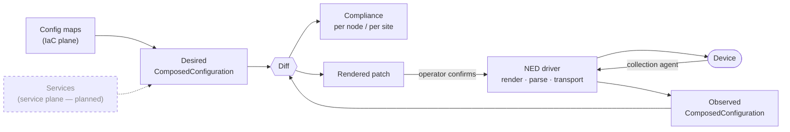

# ACE-X

**An implementation of the ACE architecture — Automation & Control Ecosystem.**

[](LICENSE)
[](https://www.python.org/downloads/)

ACE-X manages networks by keeping **what the network should be** strictly apart from **the hardware that happens to run it** and from **what the devices actually report back**. Configuration is written as code against logical nodes, rendered to real hardware through drivers, read back through the same drivers, and continuously compared.

The result is a system where infrastructure changes go through review and land in a maintenance window, while services are delivered on demand — without the two blocking each other.

---

## The ACE architecture

ACE is not a code layout. It is a way of administering and automating a network.

### 1. Abstraction, for real

An **asset** is only an asset: a vendor, a serial number, an OS version, a hardware model. It carries no configuration and no identity in the network.

A **logical node** carries everything else: hostname, role, site, sequence — and all of its configuration. It is always decoupled from the hardware that happens to run it.

A **node** is the binding of the two, with a lifecycle: `planned → init → active → decommissioned`.

```
LogicalNode  ──┐
  hostname     │
  role         ├──►  Node  ──►  the actual device
  site         │     status
  config       │
               │
Asset        ──┘
  vendor
  serial
  os / model
  ned_id
```

Because the two are separate:

- Configuration exists before the hardware does — plan a site, compile its configs, order the equipment later.
- Replacing hardware after an RMA changes an asset binding, not a single line of intent.
- A switch stack or an MLAG pair (`AssetCluster`) is several assets behind one logical node.

Configuration is **rendered to** an asset through a driver, and **read from** that asset through the same driver. One driver, both directions, one vendor-neutral model in the middle. Nothing above the driver layer knows that Cisco or Juniper exists.



### 2. Declared state is the only source — for configuration *and* for measurement

Desired configuration is never stored. It is **compiled on demand** for each logical node from config maps that are plain Python, selected by declarative filters. Ask for a node's configuration and it is computed then and there — so it cannot go stale, and it cannot drift from the code that produced it.

Observability follows the same rule. A metric is not something you wire up per device; it is **defined state**, composed from inventory parameters and configuration. A `TelemetryComponent` binds together, in one object:

- what a collector must do to obtain the measurement
- the resulting measurement name and tag schema
- the identity used to query it in a dashboard
- which capability gates its collection, and which node it belongs to

The telemetry registry is deliberately **not persisted**. It is rebuilt from inventory and configuration on every request, then rendered into collector configuration and Grafana dashboards. There is no second source of truth to fall out of sync.

### 3. Two config planes, two lifecycles — that must not block each other

This is the problem ACE exists to solve.

Infrastructure configuration and service configuration compose into the same model for the same node, but they have nothing else in common. Treating them as one thing forces a choice between reckless automation and paralysed operations. ACE refuses the choice.

|  | **Infrastructure (IaC)** | **Services** |
|---|---|---|
| Written as | Config maps in version control | Service definitions, NSO-style |
| Changes through | Pull request, peer review, merge | An order, an API call, an event |
| Delivery | **Never automatic.** A change produces a diff | Direct, closed loop |
| Applied | Deliberately, in a maintenance window | On demand |
| Optimised for | Control and auditability | Lead time |

A merged infrastructure change does not touch a device. It changes what *should* be true, the next compile picks it up, and the difference against the observed configuration becomes a **reviewable diff** — resolved under control, when the maintenance window opens.

A service, meanwhile, is delivered when it is ordered. It does not queue behind an infrastructure change, and it does not drag pending infrastructure changes onto the device with it.

**IaC with control, without stopping the service lifecycle.**

### 4. Compliance is the measurement; enforcement is a decision

ACE-X compares desired against observed continuously and reports the distance as compliance — per node, per site, and in aggregate. Reconciliation is *measured* long before anything is enforced. Nothing about a non-zero diff is an error; a diff is the normal state of a network between maintenance windows.

When the window opens, the driver renders the diff as a **patch** — only the delta, never a full configuration replay — which an operator reads before it is sent:

```bash
acex node config diff plan r1 --format commands   # see exactly what would be sent
acex node config diff apply r1                    # shows the patch, asks, then sends
```

There is deliberately **no API endpoint that pushes configuration**. The API exposes the diff; a human applies it. Enforcement is an operator action with the commands in front of them, not a background process.

Drift in the other direction — someone changed a device by hand — is handled by turning reality back into code. The reconcile path generates **config map source** from the observed state, so unmanaged change re-enters the system as a pull request rather than being silently overwritten:

```
observed drift  ──►  generated config map  ──►  peer review  ──►  merge  ──►  compiled intent
```

The same path onboards brownfield networks: point the translator at an existing device configuration and get declarative components back.

### 5. The edge does the work, and it pulls

The core holds desired state and never reaches out to a device on its own. Collection agents and telemetry agents poll a manifest carrying a `config_revision`, apply it, then acknowledge the revision they reached. The Grafana reconciler hashes the desired state and does nothing at all when nothing has changed.

Each agent is granted **capabilities** (`icmp`, `snmp`, `snmp_trap`, `mdt`, `syslog_rfc5424`) and a set of nodes. It receives only the work those grants cover. Where collection happens is policy, not configuration.

Agents pull, so they work across firewalls and segmented networks, and they scale out without the core changing.

### 6. Operational data is its own kind of data

ACE keeps three data classes apart, and does not let them borrow each other's shape:

| | What it is | Modelled as |
|---|---|---|
| **Desired configuration** | Compiled intent | `ComposedConfiguration` |
| **Observed configuration** | The device's parsed running config | `ComposedConfiguration` |
| **Operational data** | What the device reports about its *running state* | Its own models, per data type |

The first two deliberately share one model — that is precisely what makes them comparable. Operational data deliberately does **not**. LLDP neighbours, routing state, protocol adjacencies and interface counters are not configuration and never were; forcing them into a configuration model would only make them diffable against something they are not.

So operational data gets its own path end to end: its own driver methods (`get_lldp_neighbors` alongside `get_config`), its own upload endpoints, its own models carrying a `collected_at` timestamp, and its own correlation back to inventory — a discovered neighbour resolves to a node instance when ACE-X recognises it, and stays an unresolved external device when it does not. That is how the per-site topology graph gets built, and how it can show you the things attached to your network that you never put in it.

LLDP is the type that exists today. Routing state and others follow the same shape.

Physical reality will eventually be **declared** as well — planned cabling as intent. When it is, the desired-versus-observed pattern extends down to the physical layer: cabled as designed, or cabled as the electrician felt like that morning. Until then, physical topology is observed only.

---

## Configuration as code

A config map is a Python class with a `compile()` method and a filter that decides which logical nodes it applies to.

```python
from acex.config_map import ConfigMap, FilterAttribute
from acex.configuration.components.interfaces import Loopback


class MplsLoopback(ConfigMap):
    def compile(self, context):
        context.configuration.add(
            Loopback(
                index=0,
                name="Lo0",
                description="MPLS Loopback",
                ipv4=f"192.0.2.{context.logical_node.sequence}/32",
            )
        )


mpls_loopback = MplsLoopback()
mpls_loopback.filters = FilterAttribute("role").eq("core")
```

Filters compose, so placement stays declarative:

```python
cm.filters = FilterAttribute("site").eq("hq")
cm.filters = FilterAttribute("site").eq("hq") & FilterAttribute("role").eq("core")
cm.filters = FilterAttribute("role").eq("core") | FilterAttribute("role").eq("edge")
```

### Values from an external source of truth

Intent can reference a query against an integration rather than a literal:

```python
Loopback(
    index=0,
    name="Lo0",
    ipv4=context.integrations.ipam.data.ip_addresses({"role": "loopback"}),
)
```

Resolution is an **explicit operation**, not a side effect of compiling. Resolved values are persisted with their pointer, query, kind and `resolved_at` timestamp — so a compile is reproducible without reaching out to external systems, and every externally sourced value can be traced to when it was last confirmed.

### The configuration model

One vendor-neutral tree, `ComposedConfiguration`, is the pivot for everything:

| Area | Components |
|---|---|
| System | HostName, Contact, Location, DomainName, DnsServer, Clock, LoginBanner, MotdBanner |
| Access | SshServer, AuthorizedKey, VtyLine |
| AAA | aaaGlobal, aaaServerGroup, aaaTacacs, aaaRadius, authentication / authorization / accounting methods and events |
| Logging | LoggingConfig, Console, RemoteServer, FileLogging, LoggingEvent |
| SNMP | SnmpGlobal, SnmpUser, SnmpGroup, SnmpView, SnmpServer, SnmpTrap, SnmpCommunity |
| Interfaces | FrontpanelPort, ManagementPort, LagInterface, Loopback, Subinterface, Svi, InterfaceTemplate |
| L2 / L3 | Vlan, L2Domain, L3Vrf, StaticRoute, StaticRouteNextHop, Routing |
| Control protocols | SpanningTree (Global / RSTP / MSTP / RapidPVST), LacpConfig, LldpConfig, CdpConfig, Vtp |
| Security | Ipv4Acl, Ipv6Acl, Ipv4AclEntry, Ipv6AclEntry, DHCPSnooping, DhcpRelayServer |
| Flow export | NetflowGlobalConfig, NetflowExporter, NetflowCollector, NetflowRecord, SflowCollector, SfloGlobalConfig |
| Services | NtpServer, Services |

**69 component types** in total, with vendor-specific `Augment` components for the cases a neutral model should not pretend to cover.

---

## Interfaces

Everything talks to the same REST API. The web UI, the CLI and the AI tooling are peers, not layers.

**REST API** — OpenAPI at `/api/v1/docs`, OIDC-protected.

```
/api/v1/inventory/{nodes,logical_nodes,assets,sites,regions,contacts,...}
/api/v1/inventory/node_instances/{id}/configuration/desired      # rendered via NED
/api/v1/inventory/node_instances/{id}/configuration/observed     # snapshot history
/api/v1/inventory/node_instances/{id}/configuration/intent_diff  # desired vs observed
/api/v1/operations/compliance/{node_instance_id}
/api/v1/operations/compliance/site/{site_name}
/api/v1/config_components/{generate,reconcile,translate}
/api/v1/observability/agents                                     # manifest, config, ack
/api/v1/observability/grafana/{dashboards,datasources}           # generated definitions
/api/v1/health
```

**CLI** — `pip install acex-cli`

```bash
acex node list --site hq --role core
acex node config show desired r1 --path system.ntp     # compiled intent
acex node config show observed r1                      # what the device reports
acex node config show local r1 --dir ./config_maps     # compile locally, no backend
acex node config diff plan r1                          # desired vs observed, as a tree
acex node config diff plan r1 --format commands         # as the patch that would be sent
acex node config diff apply r1                         # review, confirm, send
acex node connect r1
```

**MCP server** — `pip install acex-mcp`

A curated, read-only tool surface over inventory, configuration and topology, with token pass-through auth. Point Claude Code, Claude Desktop or any MCP client at it and ask about the network in plain language.

**AI Ops** — Built into the backend. Named providers with ordered failover chains, configurable in `app.py` or entirely through `ACEX_AI_*` environment variables. The assistant can *suggest* opening a page in the UI; the user always clicks. It never navigates on its own.

---

## Web UI

The frontend lives in its own repository: **[acex-labs/acex-frontend](https://github.com/acex-labs/acex-frontend)**

React 19 + Vite + Tailwind, OIDC via `oidc-client-ts`, TanStack Query against the ACE-X API. Topology is rendered with React Flow, geography with Leaflet.

It is organised as **modules** — self-contained verticals that register their own navigation and code-split routes. Adding one is a single file plus one line in the registry.

| Module | Contains |
|---|---|
| **Network** | Nodes, Sites, Regions, Logical Nodes, Assets, Contacts, Import |
| **Configs** | Config Maps, Builder, Reconcile, Translator, NEDs |
| **Observe** | Dashboards, Config History, ICMP, Telemetry |
| **Operations** | Workflows, Bulk Actions, Triggers, Scheduled |
| **Autopilot** | AI Ops, Agents |
| **Settings** | Credentials, Telemetry Agents, Collection Agents |
| **Platform** | Admin (only visible in admin mode) |

Node and site detail pages carry tabs for configuration, hardware, LLDP neighbours, snapshot history and site topology.

---

## Extending ACE-X

Every extension point is a separately installable, independently versioned package. The core is never modified.

**NEDs (Network Element Drivers)** — a renderer, a parser and a transport. Chosen per asset via `ned_id`, so one installation drives mixed-vendor estates.

```python
from acex_devkit.drivers import NetworkElementDriver

class MyDriver(NetworkElementDriver):
    renderer_class = MyRenderer   # ComposedConfiguration + Asset → device config
    parser_class   = MyParser     # device config → ComposedConfiguration
    transport_class = MyTransport # get_config / send_config / execute
```

Shipped: `acex-driver-cisco-ioscli`, `acex-driver-juniper-junoscli` — with **121 hardware model definitions** describing real port layouts.

**Config normalizers** — declarative rules that strip non-intent lines (counters, timestamps) and redact secrets from collected configurations, in two isolated passes, so diffs mean something and secrets are never stored.

**Integration plugins** — adapters that back inventory objects with an external source of truth (NetBox is included) or expose queryable data to config maps.

**Telemetry providers** — functions that inspect ACE-X state and yield telemetry components, registered with `register_provider`.

**Agents** — anything that polls a manifest, applies it and acknowledges a revision.

---

## Repository layout

```
backend/    acex           — automation engine, API, config compiler, observability
devkit/     acex-devkit    — ComposedConfiguration, differ, NED base classes, normalizer
client/     acex-client    — typed REST client
cli/        acex-cli       — command line interface
mcp/        acex-mcp       — MCP server
worker/     acex-worker    — distributed task execution (scaffold)
drivers/    NEDs           — cisco_ios_cli, juniper_junos_cli
agents/     collection-agent, telemetry-agent, grafana-sync
mock-device/               — SSH + SNMP device simulator for development
docs/                      — integration examples
```

| Package | Install |
|---|---|
| **acex** | `pip install acex` |
| **acex-cli** | `pip install acex-cli` |
| **acex-devkit** | `pip install acex-devkit` |
| **acex-client** | `pip install acex-client` |
| **acex-mcp** | `pip install acex-mcp` |

---

## Quick start

The full stack — backend, frontend, Postgres, InfluxDB, Grafana, Keycloak, Vault, three agents and six simulated devices — comes up with one command.

```bash
git clone https://github.com/acex-labs/acex.git
cd acex
./setup.sh          # or: task setup
```

`setup.sh` adds a hosts entry for Keycloak, creates `.env`, clones the frontend next to this repo, builds and starts everything.

```
Frontend   http://localhost:3000     admin / admin
Backend    http://localhost:8080     /api/v1/docs
Grafana    http://localhost:3001     admin / admin
Keycloak   http://keycloak:8180      admin / admin
```

Then seed simulated devices and agents:

```bash
task seed
```

Common tasks: `task up`, `task down`, `task logs -- backend`, `task ps`, `task reset`.

### Running the engine yourself

```python
from acex import AutomationEngine
from acex.database import Connection
from acex.plugins.integrations.netbox import Netbox

db = Connection(dbname="acex", user="postgres", host="localhost", backend="postgresql")

ae = AutomationEngine(db_connection=db)
ae.add_integration("ipam", Netbox(url="https://netbox.example.net/", token=NETBOX_TOKEN))
ae.add_configmap_dir("config_maps")
ae.add_cors_allowed_origin("https://acex.example.net")

app = ae.create_app()
```

```bash
python -m acex
```

Migrations run on startup. See [`docs/examples/example1/`](docs/examples/example1/) for a complete application, and [`DEVELOPMENT.md`](DEVELOPMENT.md) for working on the packages themselves.

---

## Project status

ACE-X is under active development and pre-1.0 as a whole, though individual packages are further along than others.

**Working today**

- Inventory: assets, asset clusters, logical nodes, nodes, sites, regions, contacts, credentials, management connections
- Configuration as code: config maps, filters, 69 component types, external value resolution with provenance
- Vendor-neutral model with rendering and parsing through NEDs (Cisco IOS, Juniper Junos)
- Observed configuration collection, snapshot history, normalization and secret masking
- Structural desired-vs-observed diff, compliance per node and per site
- Patch rendering and operator-confirmed apply through the CLI (`config diff plan` / `apply`)
- Reconcile and translate — drift and brownfield configs back into config map source
- Declarative observability: telemetry components, capability-gated agents, generated collector configs, generated Grafana dashboards and datasources
- Operational data as its own class: LLDP collection, neighbour-to-inventory correlation, per-site topology graph
- REST API with OIDC, typed client, CLI, MCP server, AI Ops with provider failover
- Web UI: Network, Configs and Settings modules

**On the roadmap**

- **The service plane.** Closed-loop service delivery — the second half of section 3 — is designed but not yet built. Today all configuration enters through the IaC plane.
- **Maintenance windows and change approval.** Applying a patch works, but the window itself is not yet a modelled object: no scheduling, no approval record, no audit trail of who applied which patch when.
- **Operations module** — workflows, bulk actions, triggers and scheduling are scaffolded in the UI, not implemented.
- **Declared physical topology.** Planned cabling as intent, so observed LLDP can be diffed against how the network was designed to be wired.
- **More operational data types** — routing state and others, each with its own model rather than bent into the configuration tree.
- Streaming telemetry (MDT) and syslog ingestion beyond the declared capability vocabulary.
- The worker package is a scaffold; distributed task execution is not implemented.

---

## Contributing

Contributions are welcome. See [CONTRIBUTING.md](CONTRIBUTING.md), and [DEVELOPMENT.md](DEVELOPMENT.md) for environment setup, branch naming and the pre-commit hooks.

Branches follow `<prefix>/<description>` with Conventional Commits prefixes — `feat/add-ntp-support`, `fix/static-route-nil-check`.

## License

**GNU Affero General Public License v3.0** — see [LICENSE](LICENSE).

- ✅ Free to use for any purpose
- ✅ Full source available, modify freely
- ⚠️ If you modify ACE-X and run it as a network service, you must share your modifications
- ⚠️ Derivative works must also be AGPL-licensed

The AGPL keeps improvements flowing back to everyone who relies on ACE-X, including when it is run as a service.

**Commercial licences** are available for organisations that need to use ACE-X without AGPL obligations — contact **license@acex.dev**.

## Authors

**Johan Lahti** &lt;johan.lahti@acebit.se&gt;
**Jani Naamanka** &lt;jani@naacon.se&gt;

## Links

- Backend and packages — https://github.com/acex-labs/acex
- Web UI — https://github.com/acex-labs/acex-frontend
- Issues — https://github.com/acex-labs/acex/issues
