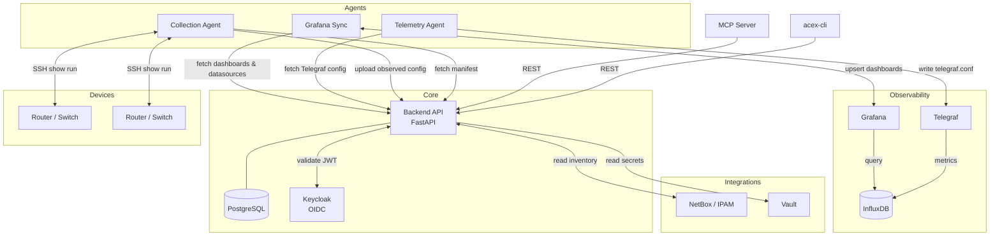
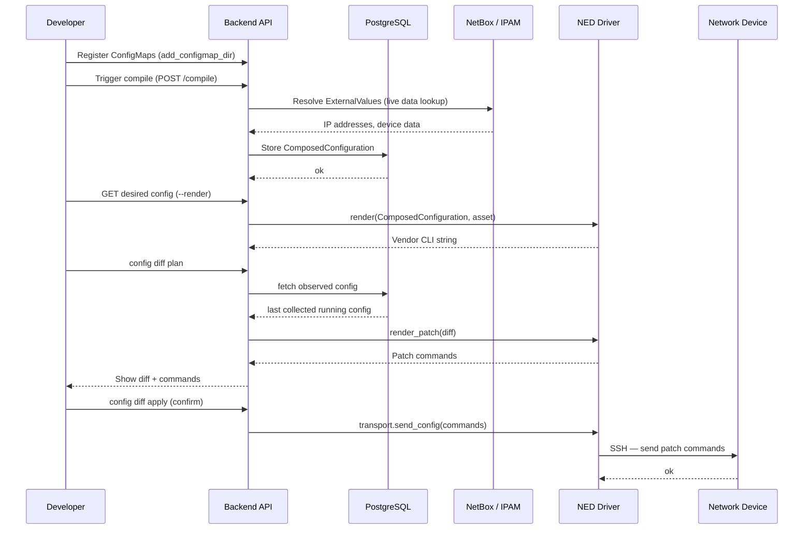
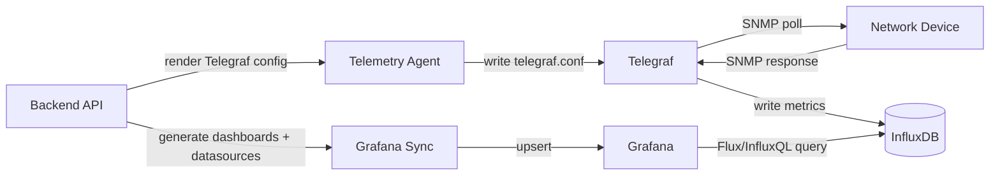
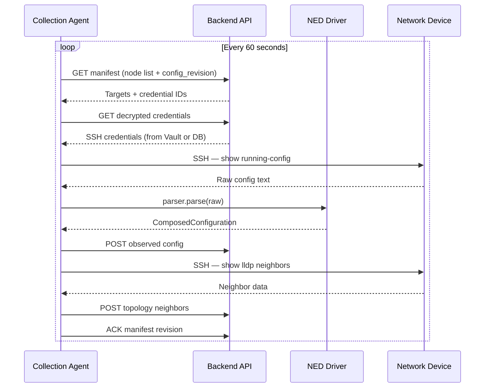
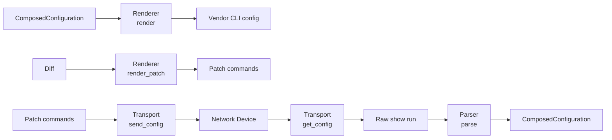
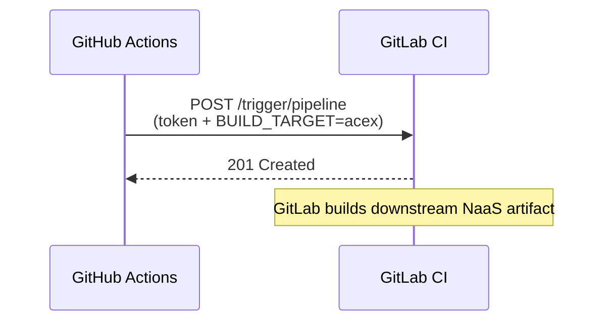

# Architecture

## System overview

ACE-X is structured as a backend API surrounded by lightweight agents that bridge it to the outside world — network devices, observability tools, and AI assistants.

## Data model

Three core entities connect physical hardware to vendor-agnostic configuration:

| Entity | What it is |
|--------|------------|
| **Asset** | A physical device (serial number, hardware model, NED driver assignment) |
| **Logical Node** | A configuration template — compiled ConfigMaps produce a `ComposedConfiguration` for this node |
| **Node Instance** | A deployed node: one Asset bound to one Logical Node, with a management IP and SSH credentials |

## Config compilation flow

From a Python ConfigMap to CLI commands on a device:

## Observability flow

How device metrics get from a router to a Grafana dashboard:

## Collection agent flow

How observed configs are kept up to date:

## NED driver architecture

Drivers (NEDs) are Python packages loaded as setuptools entry points. Each driver implements four roles:

## GitHub → GitLab build trigger

On every push to `main` and on release events, a GitHub Actions workflow triggers a downstream GitLab pipeline via the GitLab pipeline trigger API. This is a one-way call — GitHub fires the trigger, GitLab builds independently.

