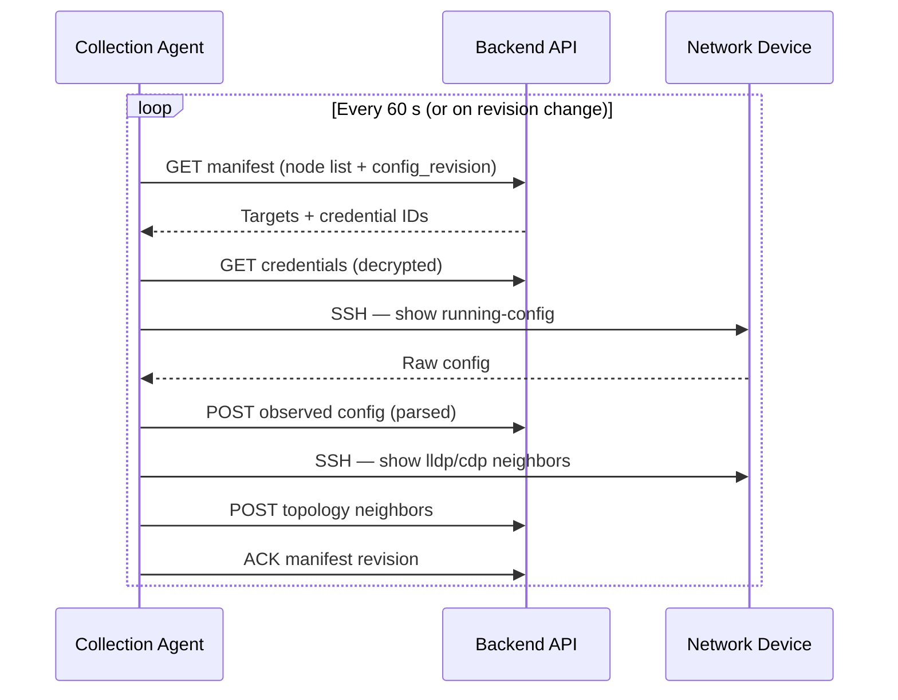
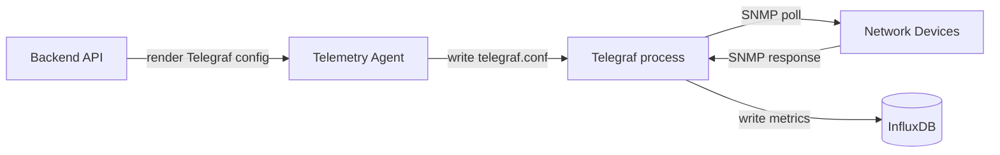
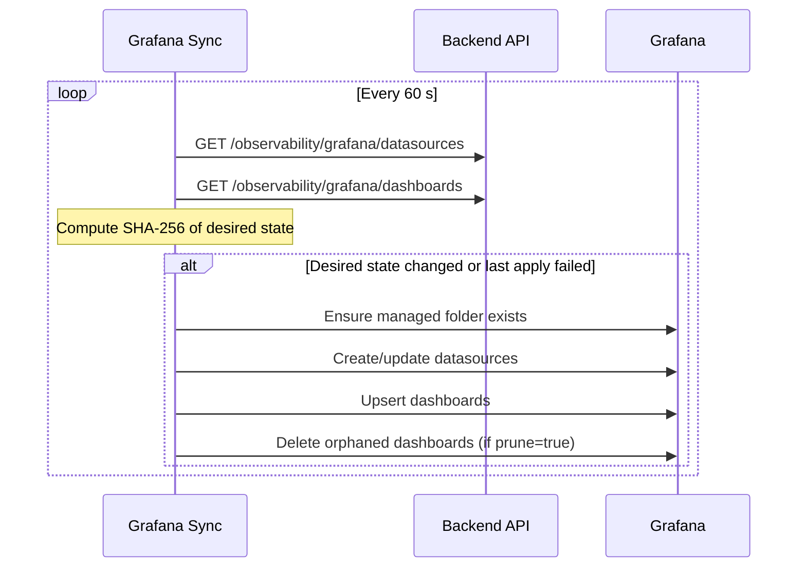

# Agents

ACE-X uses three long-running agents to bridge the backend to the outside world. Each agent polls the backend on a configurable interval, compares desired state to actual state, and reconciles.

## Collection Agent

**Purpose:** Pull running configs from network devices and upload them to ACE-X.



The collection agent:

- Fetches a manifest from the backend listing which nodes to collect
- Re-triggers a collection cycle when `config_revision` changes (new nodes added, parameters changed)
- Uses up to 20 concurrent SSH connections
- Downloads and installs missing NED drivers from the backend via pip before every collection
  cycle — no driver is baked into the agent image, so a NED added or upgraded on the backend is
  picked up without rebuilding or restarting the agent (an upgrade of a driver the process has
  already imported is the exception and is logged as needing a restart)
- Parses the raw config through the NED driver's parser before uploading — the backend stores the structured `ComposedConfiguration`, not raw text

### Configuration

```bash
ACEX_API_URL=http://backend:8080
ACEX_AGENT_ID=<collection-agent-uuid>
ACEX_CLIENT_ID=collection-agent
ACEX_CLIENT_SECRET=...
ACEX_ISSUER_URL=http://keycloak:8180/realms/acex
```

## Telemetry Agent

**Purpose:** Keep a Telegraf configuration file in sync with ACE-X's desired observability state.



The telemetry agent:

- Polls the backend every 60 seconds for its agent object
- Re-writes `telegraf.conf` when `config_revision` changes
- Does not run Telegraf itself — Telegraf is a co-located binary that reads the config file independently
- ACE-X generates the full Telegraf config from: SNMP input blocks (one per monitored node), ICMP inputs, syslog/trap inputs, and InfluxDB output blocks

### Configuration

```bash
ACEX_API_URL=http://backend:8080
ACEX_AGENT_ID=<telemetry-agent-uuid>
ACEX_CLIENT_ID=telemetry-agent
ACEX_CLIENT_SECRET=...
ACEX_ISSUER_URL=http://keycloak:8180/realms/acex
TELEGRAF_CONFIG_PATH=/etc/telegraf/telegraf.conf
```

## Grafana Sync

**Purpose:** Keep a Grafana instance in sync with ACE-X-generated dashboards and datasources.



The grafana-sync agent:

- Detects changes via a SHA-256 digest of the full desired state — avoids unnecessary API calls
- Only manages dashboards in its own folder — never touches user-created dashboards in other folders
- Retries on the next cycle if an apply fails

### Configuration

```bash
ACEX_API_URL=http://backend:8080
ACEX_CLIENT_ID=grafana-sync
ACEX_CLIENT_SECRET=...
ACEX_ISSUER_URL=http://keycloak:8180/realms/acex
GRAFANA_URL=http://grafana:3000
GRAFANA_TOKEN=...
```
