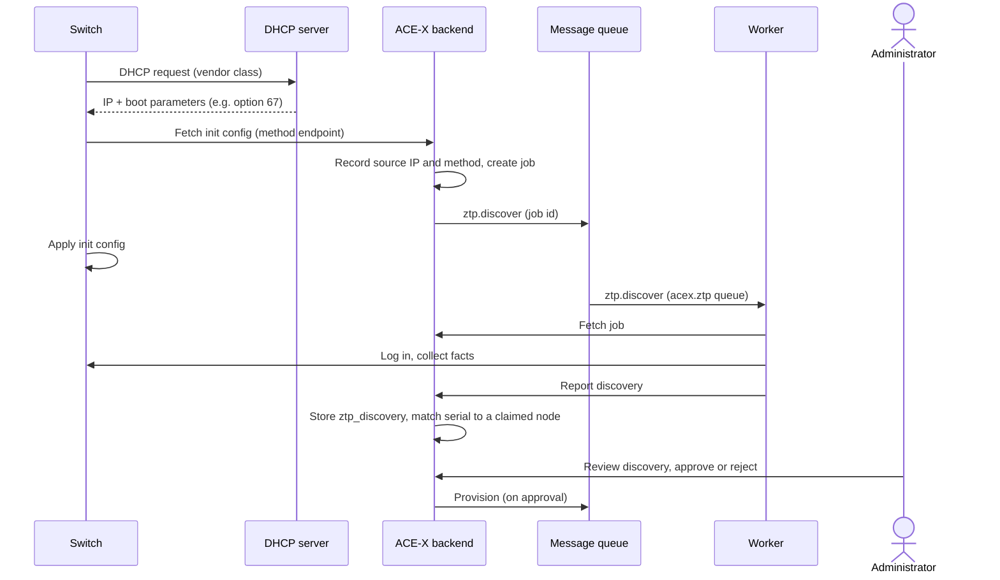

# Zero touch provisioning

Zero touch provisioning (ZTP) takes a switch from factory default to a device that is registered in ACE-X and reachable for further configuration, without anyone touching it.

Nothing the switch reports is trusted on its own. Fetching the init config is unauthenticated, and the serial number comes from the device itself, so discovery only records a claim: "the device at IP Y says it is serial X". An administrator always reviews that claim and approves it before ACE-X pushes any full configuration.

## Workflow

### ZTP methods

How a device is brought up differs per platform: what DHCP hands out, what the device fetches, what the init config contains and how the worker collects facts. Each combination is a named ZTP method. The method is determined by which init endpoint the device fetches, and the DHCP server picks that endpoint from the device's vendor class.

The method is stored on the job and on the `ztp_discovery` row. It tells the worker which platform to expect and how discovery is done.

| Method | Platform | Init | Discovery |
|---|---|---|---|
| `cisco-iosxe-python` | Cisco IOS-XE (e.g. Catalyst 9300) | DHCP option 67 points to a `ztp.py` script that the switch downloads over HTTP and runs | SSH with the temporary credentials from the init config |

### 1. Init

The switch boots with no configuration and requests an IP address over DHCP. The lease includes boot parameters that depend on the vendor class and point the device to the init endpoint for its ZTP method.

The init config is the smallest possible configuration that makes the switch reachable from ACE-X. With `cisco-iosxe-python` it generates a certificate for SSH and configures a temporary username and password.

The init config must be fetched over HTTP. A transfer the backend does not see itself, such as TFTP from a separate server, gives no source IP to register.

### 2. Registration

When the init config is fetched, the backend records which IP fetched it — from `X-Forwarded-For` if the request came through a trusted proxy, otherwise from the packet's source address. The IP and the ZTP method are stored with a new job, and a `ztp.discover` message is published on the message queue.

At this point the backend only knows an IP address and a method. It does not know which device, asset or node it is talking to.

### 3. Discovery

A worker consumes the message from the `acex.ztp` queue. It reads the job id from the message and fetches the job from the ACE-X API, which tells it that this is a `ztp.discover` job, which IP to target and which ZTP method was used.

The method decides how the worker collects facts. With `cisco-iosxe-python` it logs in over SSH and collects the serial number, hardware model, OS and OS version.

The message is published when the init config is fetched, before the device has applied it, so the worker retries with backoff until the device answers or a timeout is reached.

It reports the facts back to the backend, which stores them as a row in `ztp_discovery`. Discovery does not create or change assets or nodes; the row is evidence waiting for review. If the worker cannot log in or collect facts before the timeout, the job fails and no row is written.

### 4. Matching

The backend looks for an asset with the reported serial number that is bound to a node in `awaiting_device`. If it finds one, it links the discovery to that node and moves the node to `awaiting_approval`.

### 5. Approval

An administrator reviews the discovery before anything else happens. The review shows, side by side:

- the serial number the node expects (from its claimed asset) and the serial number the device reported
- the source IP that fetched the init config
- the reported hardware model, OS and OS version, compared with the asset
- when the discovery happened, with a link to its job
- conflicts: the same serial reported from more than one IP, the same IP previously reporting a different serial, or facts that do not match the asset

Approval is always required. Claiming an asset never counts as approving it.

- **Approve:** the discovery is marked approved, its source IP becomes the node's management connection for provisioning, and the node moves to `provisioning`.
- **Reject:** the discovery is marked rejected and the node goes back to `awaiting_device`, waiting for the right device to show up.

### 6. Provisioning

To be defined. Full configuration is compiled, pushed over SSH and verified; the node ends in `provisioned` or `failed`.

## Node provision status

`provision_status` on the node tracks where its device is in this flow. Steps that happen before ACE-X knows which node a device belongs to (init and discovery) are tracked on the job, not on the node.

| Status | Kind | Meaning |
|---|---|---|
| `unprovisioned` | steady | Bound to an asset, no provisioning requested |
| `adopted` | steady | Brownfield: already running when brought under management |
| `awaiting_device` | in flight | Claimed; waiting for the device to be discovered |
| `awaiting_approval` | in flight | A discovery matched this node; waiting for an administrator |
| `provisioning` | in flight | Approved; full config being pushed and verified |
| `provisioned` | steady | Provisioned by ACE-X and verified |
| `failed` | stuck | Until retried or cancelled; the reason is on the job |

## The `ztp_discovery` table

One row per discovery the worker reports.

| Column | Description |
|---|---|
| `id` | Primary key |
| `job_id` | The `ztp.discover` job that produced it |
| `source_ip` | IP that fetched the init config |
| `method` | ZTP method used, e.g. `cisco-iosxe-python` |
| `serial_number` | Serial number as reported by the device |
| `vendor`, `hardware_model`, `os`, `os_version` | Facts collected by the worker |
| `node_id` | Node it was matched to, if any |
| `review_status` | `unreviewed`, `approved` or `rejected` |
| `reviewed_by`, `reviewed_at` | Who reviewed it and when |
| `created_at` | When the discovery was reported |

The worker reports a discovery by finishing its `acex.ztp.discover` job with a result (`serial_number`, `vendor`, `hardware_model`, `os`, `os_version`). The row is written, and the node matched, in the same transaction that marks the job succeeded.

## Call-ins API

Every init config fetch starts a `ztp.discover` job. `/api/v1/ztp_calls` shows them one device per source IP, newest first, with the latest job deciding the stage: `waiting` (no worker has picked it up), `discovering`, `failed` or `reported` (a `ztp_discovery` row awaits review). A device that reboots and calls in again adds an attempt to the same IP.

Call-ins are not tied to a site. The Discovery page can group them by subnet, with a prefix length the operator picks. A stronger IP-to-site link is left for when ACE-X has an internal IPAM.

| Method | Path | Description |
|---|---|---|
| `GET` | `/ztp_calls` | Call-ins per IP. Filter: `stage` |
| `POST` | `/ztp_calls/{ip}/retry` | Queue discovery of that IP again; 503 without a broker |

## Review API

Reviews live under `/api/v1/ztp_discoveries`, which requires a token. They are deliberately not under `/api/v1/ztp`: everything there is public so that a factory-default device can fetch its init config.

| Method | Path | Description |
|---|---|---|
| `GET` | `/ztp_discoveries` | List discoveries, newest first. Filters: `review_status`, `node_id`, `serial_number`, `source_ip` |
| `GET` | `/ztp_discoveries/{id}` | One discovery, with `expected` (the claimed asset) and `conflicts` |
| `POST` | `/ztp_discoveries/{id}/approve` | Approve; other unreviewed discoveries for the same node are rejected |
| `POST` | `/ztp_discoveries/{id}/reject` | Reject; the node goes back to `awaiting_device` unless another discovery awaits review |

Approving or rejecting a discovery that is already reviewed, or approving one whose node is not in `awaiting_approval`, answers 409.

## Open questions

- A discovered serial with no matching claim: should it show up under unclaimed assets from the `ztp_discovery` row, and should claiming it create the asset? Either way the node still goes through `awaiting_approval`.
- How long `unreviewed` discoveries are kept, and whether a newer discovery for the same serial supersedes an older one.
- More methods. Arista EOS ZTP (option 67 URL) and Junos ZTP (option 43, HTTP transfer mode) fit the same flow; the Junos init config must also set root authentication and enable SSH. Cisco PnP is a different protocol: the backend acts as a PnP server, and the device reports its serial number in the protocol itself, so discovery may not need SSH. A PnP serial number is still self-reported and goes through approval like any other.
